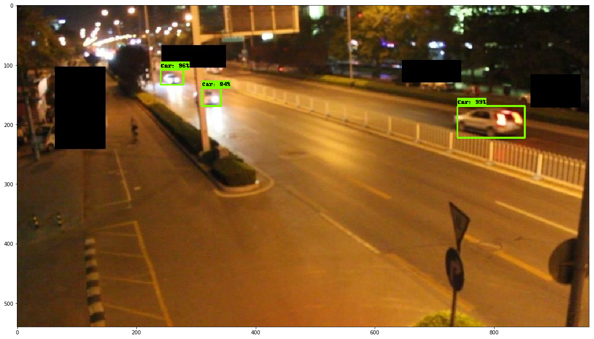
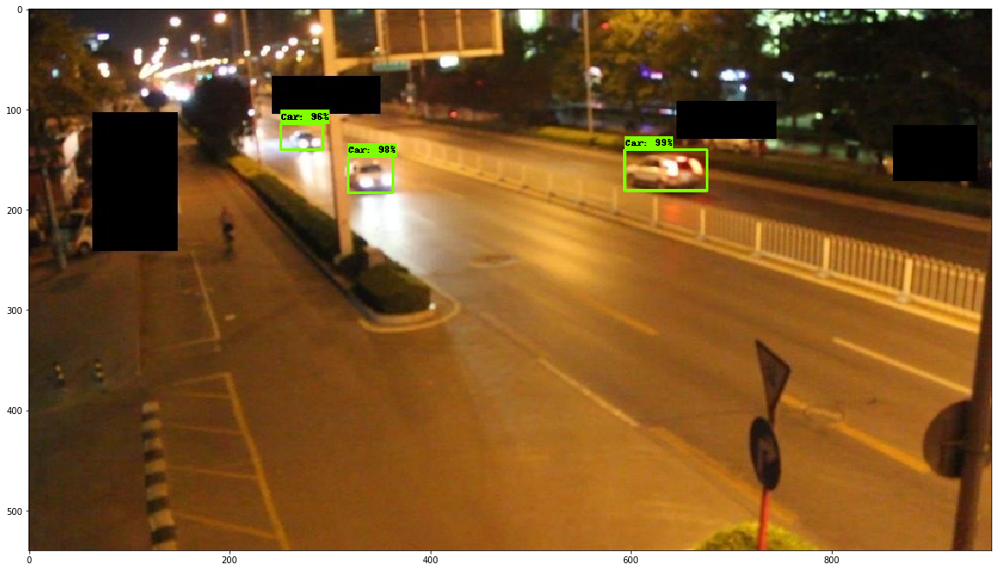
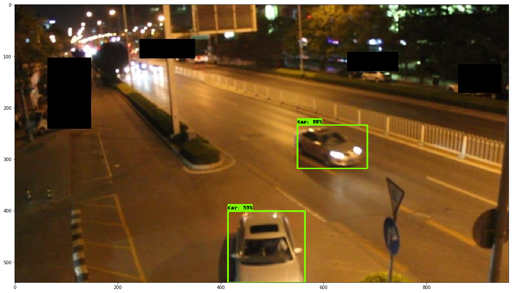

# MultiObjectTracking
Track Multiple objects

#Introduction

    The project has three main components 
    
    1) A Object Dection 
    2) A Reidentification CNN
    3) A Tracking algo 
    
The dataset taken was from  DETRAC Object Tracking and we used Mask RCNN as base for training object detection in each frame of videos
and then a CNN classifier was trained using arcface cosine loss to get layer with best reidentication and finally deepsort was used for tracking.

Here are some of the results on dataset it never seen and differnt time of day ie night time 

Object tracking

example2

Object detection

About Object Tracking dataset

The DETRAC Object Detection Benchmark consists of a training set (DETRAC-train: 83,791 frames, 577,899 bounding boxes) and a testing set (DETRAC-test: 56,340 frames, 632,270 bounding boxes). All images are in 24-bit color JPEG format with the resolution of 960×540. Specially, we annotated 8250 vehicles in the benchmark, including 5936 vehicles (i.e., "car": 5177, "bus": 106, "van": 610, "others": 43) in the DETRAC-train set and 2314 vehicles (i.e., "car": 1961, "bus": 199, "van": 123, "others": 31) in the DETRAC-test set. All vehicles in the video frame except the ones in the 'don't care' region are annotated and evaluated in our benchmark.

@article{DETRAC:CoRR:WenDCLCQLYL15,
  author    = {Longyin Wen and Dawei Du and Zhaowei Cai and Zhen Lei and Ming{-}Ching Chang and
               Honggang Qi and Jongwoo Lim and Ming{-}Hsuan Yang and Siwei Lyu},
  title     = { {DETRAC:} {A} New Benchmark and Protocol for Multi-Object Detection and Tracking},
  journal   = {arXiv CoRR},
  volume    = {abs/1511.04136},
  year      = {2015}
}      

